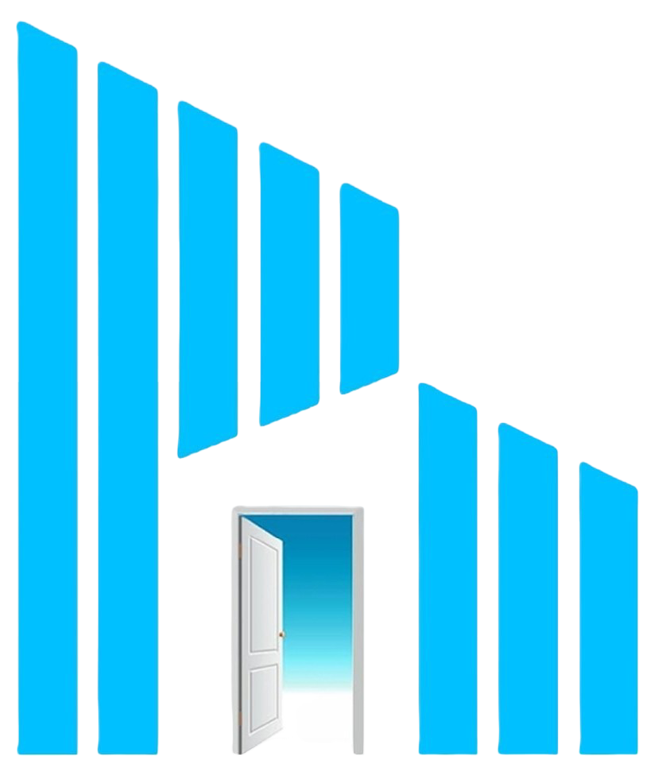

<div align="center">
  

  <h1>
    <a href="https://pinnaclebuilders.co">
      
    </a>
  </h1>

  <p align="center">
    <strong>A high-end, modern, and interactive real estate and construction platform built with React & TailwindCSS.</strong>
  </p>

  <p align="center">
    
    
    
    
  </p>
  
  <br />
</div>

## 🌟 Overview

**Pinnacle Builders & Promoters** is a fully custom, luxury web application tailored for a premier real estate construction firm. Designed using the sophisticated **Liquid Glass Design System**, the application offers a premium user experience featuring frosted glass effects, smooth micro-animations, and striking visual elements that command attention.

## ✨ Key Features

- **Liquid Glass Aesthetics:** Frosted UI components, dynamic gradient backgrounds, and deep slate hues.
- **Fluid Animations:** Powered by `framer-motion`, featuring magnetic scroll effects, staggered entrances, and hover-to-zoom galleries.
- **Dedicated Investor Portals:** Detailed breakdowns for both Indian and NRI investors with categorized FAQs and checklists.
- **Interactive Gallery:** A beautifully curated masonry-style media layout combining high-resolution project images and seamless video integration.
- **SEO Optimized:** Best practices implemented throughout to ensure strong search engine visibility.
- **Fully Responsive:** Flawless rendering and layout fluidity across all desktop, tablet, and mobile devices.

## 🛠 Tech Stack

| Technology | Description |
| --- | --- |
| **[React 18](https://react.dev/)** | Core UI library for component-based architecture. |
| **[Vite](https://vitejs.dev/)** | Next-generation frontend tooling for ultra-fast builds. |
| **[Tailwind CSS](https://tailwindcss.com/)** | Utility-first CSS framework for rapid styling. |
| **[Framer Motion](https://www.framer.com/motion/)** | Production-ready declarative animations. |
| **[Lucide React](https://lucide.dev/)** | Beautiful, clean, and modern iconography. |
| **[React Router](https://reactrouter.com/)** | Client-side routing and navigation. |

## 🚀 Getting Started

To run this project locally, follow these simple steps:

### 1. Clone the repository
```bash
git clone https://github.com/your-username/pinnacle-builders.git
cd pinnacle-builders
```

### 2. Install Dependencies
```bash
npm install
```

### 3. Start the Development Server
```bash
npm run dev
```

### 4. Build for Production
```bash
npm run build
```

---

<div align="center">
  <p>Built with ❤️ for <b>Pinnacle Builders & Promoters</b></p>
  
</div>
